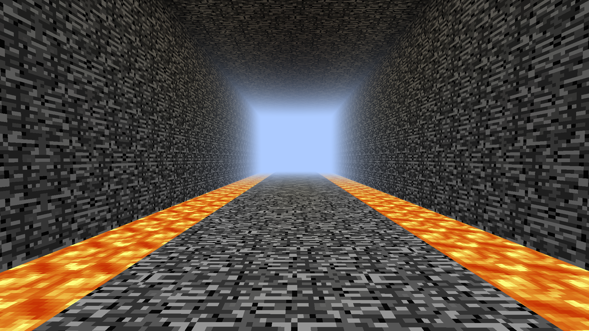
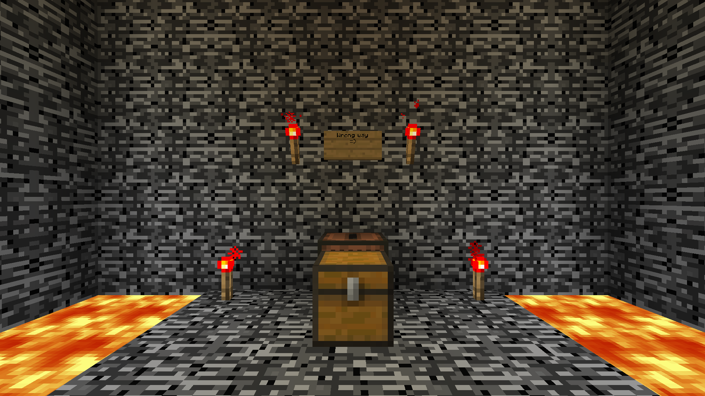
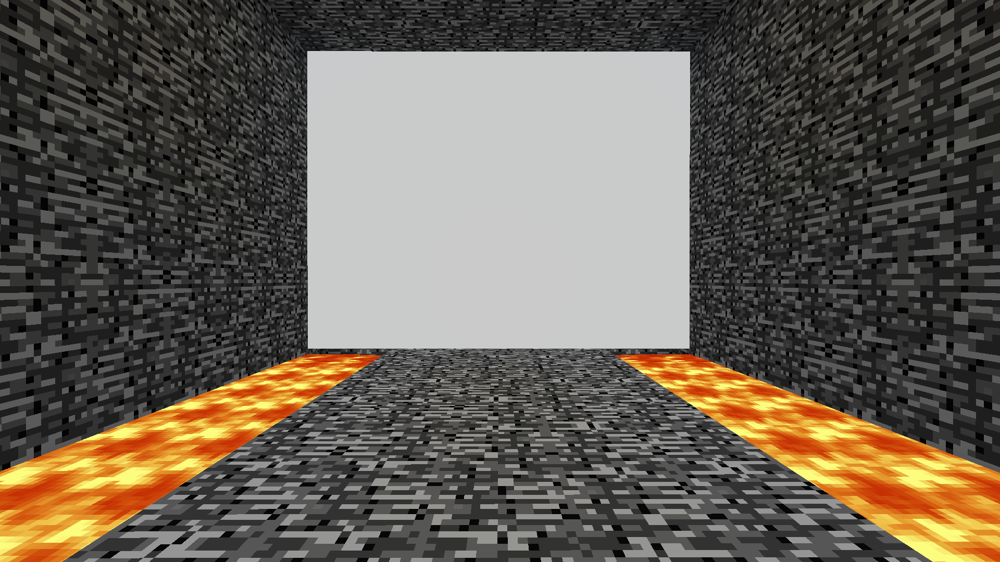

**Null Torture** is an infinitely extending 9x7 bedrock tunnel. On both sides of the tunnel are lava channels 2 blocks wide and 1 block deep.

While traveling through the dimension, it is possible to come across signs left on the floor by an unknown person, describing their stay there and thoughts.

The tunnel has no intersections or ways beyond its boundaries, so the player can only go forward or backward. One way or another, sooner or later the end will be reached in both directions. Ironically, what is a dead end, on the other side of the wall is an exit, and vice versa.

## Dead End

The dead end is a wall of bedrock blocking the way forward, but with additions that are out of place in the overall atmosphere of the dimension.

On the wall is a sign saying "Wrong way =)", with redstone torches on either side. There are also redstone torches on the floor on both edges of the path.

Notable is the jukebox against the wall and the chest in front of it. The chest is filled with name.revuxor, with a Music Disc chirp in the center.

All of this seems to be left by [Revuxor](../entities/revuxor) himself. The exact purpose is unknown, but if he only wanted to mock the player, then leaving both the jukebox and the disc with it was not necessary, which inclines towards the option with a probable attempt at emotional support for the player.

## Exit

The exit from the Null Torture is a wall of glowing white blocks 53135Exit6436. Upon touching them, the player will be teleported back to the Overworld.
