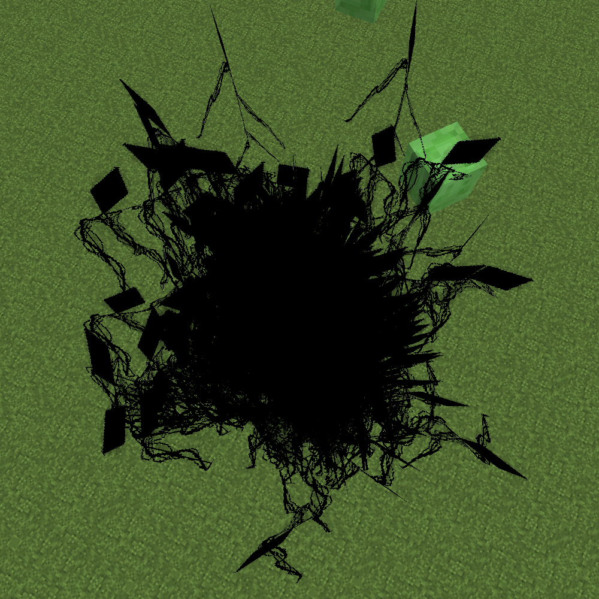
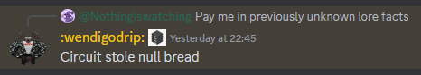

import { Tabs, TabItem, Steps } from "@astrojs/starlight/components";

**Circuit** is an intelligent Void Creature and the lowest in their chain of command.

It is capable of shapeshifting, as shown with impersonation of xXram2dieXx (formerly 0nullvoid0) and Deceiver behaviour in order to try to trick the player.

On 06.09.2019 Circuit takes the appearance of missing xXram2dieXx and "returns" to the server, explaining his absence by "dealing with some "troubles" with his family". It infiltrates the clan members' circle.

## Appearance

A pitch black, wire-like entity with a rhombus shaped head. Approximately 7 blocks tall. His upright standing gait is awkward and he is frequently observed to be down on all fours, skittering about.

## Behaviour

Circuit's spawns are mostly limited to caves, more common in the deepslate layer and the Deep Dark. Upon spawning, one of Minecraft's typical cave noises will play.

### Stare

Circuit will appear on the cave floor and stare at the player, while standing on all fours with its head pointing down. Getting way too close or looking directly at it for a few seconds will prompt it to stand upright and begin chasing the player.

When it spawns in this state, all hostile mobs in the vicinity will despawn. Currently unknown if this extends to peaceful mobs on the surface or any named mobs.

### Chase

When it chases the player, it's surrounded by black square and small bloodshot eye particles (Old Chase). Currently, it does not have any particles around it. Instead, it will display red glitchy text on the players screen with varying messages. It's capable of destroying blocks in its chasing state, climb up walls, and can tunnel or bridge over the water towards whoever it is chasing, it will also force you to look at it sometimes. Upon catching up to the player, it will kill and kick them with the message "no more running."

### Flee

There's a chance that instead of attacking the player, Circuit will scuttle away from the player if they draw too near. If the player insists on following him, Upon being cornered and observed for a prolonged period of time, Circuit will blind them and crash their game.

### Deceiver

An entity looking like Null will spawn somewhere nearby the player, announced with a chat message saying that the imitated player has joined the game. The Deceiver will be wearing whatever armour the imitated player was wearing and holding an iron axe. It will immediately start chasing the player, but can be outran. After a while of not being able to get close to the player, the Deceiver will despawn with a message announcing that the player has left the game. Getting too close, on the other hand, will make Circuit reveal itself and revert to its usual Chase state.

This is the only instance of Circuit that can spawn on the surface, making it incredibly rare. It is currently unknown if the Deceiver can spawn underground.

### Creeper Disguise

Circuit will spawn in a creeper disguise with a distinct darkened texture and will begin to roam around.

Getting too close will make Circuit reveal itself and revert to its usual Chase behavior.

### False Villager

Circuit will appear as a villager with the TESTIFICATE name tag and will begin to roam around. Once it spots the player, it will follow them, keeping some distance.

It can be identified by its modern Minecraft-style clothing, the lack of villager sounds, and the player damage sounds.

Circuit will reveal itself and begin to Chase the player if the False Villager is killed, otherwise if the player decides to hide and the False Villager goes back to roam around, eventually after a while Circuit will also reveal itself.

Not all TESTIFICATE villagers will be Circuit.

### Pig Circuit

Circuit will appear in a pig disguise, visually indistinguishable from normal pigs. Once it spots the player, it will follow them, keeping some distance.

When damaged, it will play player damage sound and begin chasing the player in pig form, dealing 1.5 hearts of damage.

Circuit seems to reveal itself randomly, and when it does, it reverts to its Chase state.

## Notes

<Steps>
1. Loud.
2. It has been confirmed that a lot of the deaths from TBS seem to be associated with Circuit. One in particular is rather gruesome and troubling. Circuit killed [Revuxor](/wiki/entities/revuxor) IRL, having left Revuxor's computer from the screen and invaded his home before ripping him apart.
3. Exceedingly common in nether caves below Y=25
4. Circuit can sometimes spawn, running towards the player with quiet footsteps, upon contact, The player will be blinded and their game crashed. Might be a variation of the "stare" behavior. Can be observed in the Nether at low Y levels.
</Steps>

## Media

import jumpscare from "../../../../assets/wiki/Circuitjumpscare.ogg";
import nullJumpscareOverhaul from "../../../../assets/wiki/Nulljumpscareoverhaul.ogg";
import youWillRegretThat from "../../../../assets/wiki/Youwillregretthat.ogg";

<Tabs>
    <TabItem label="Gallery">
        |  |
        | ---------- |
        | photo taken seconds before disaster |

        |  |
        | ---------- |
        | Results of a foolish attempt to enable devmode in 1.9.3 |

        |  |
        | ---------- |
        | Looore |
    </TabItem>

    <TabItem label="Sounds">
        | <audio src={jumpscare} controls /> |
        | ---------- |
        | Jumpscare |

        | <audio src={nullJumpscareOverhaul} controls /> |
        | ---------- |
        | Chase |

        | <audio src={youWillRegretThat} controls /> |
        | ---------- |
        | Hurt sound (Stalk) |
    </TabItem>
</Tabs>
