**Entities** within [The Broken Script](/wiki/tbs) range from player-like to
non-euclidean horrors of the void made of geometry or cables/wires. Many of them
are hostile, some are conditionally hostile dependant on player reaction to
their presence (ie. looking at them, attacking them, drawing too close to them,
etc.). Abilities and behaviour can differ between entities, though the most
severe conclusion to an interaction with an entity from The Broken Script is the
banning of the player from their own world.

Most entities spawn naturally in the overworld depending on a few variables and
conditions. Some, present within the mod's files, are not included into a
world's natural spawnrate and must be summoned either through a chat command or
a command block.

For the sake of wiki categorization we will maintain this page as the page for
Entities found within the mod. However, let it be clear that there is a very
explicit distinction between the wiki's categorization of a minecraft entity and
what _defines_ an 'entity' in the TBS.

Notably, all entities, with the exception of the Void Creatures, appear to have
formerly been players who were transformed into what they are in one way or
another, whether through corruption, interaction with Void Creatures, or
otherwise.

Not all transformed players end up similar to each other, or even what they were
before, ultimately varying widely not only in appearance but also in their
power, capabilities, and consciousness. The criteria by which a player is
determined to be what type of entity after transformation are currently unknown.

## Souls

**Souls** are entities that have retained their consciousness after
transformation. They appear to retain memories and knowledge they had prior, and
are still able to think, more or less, and express themselves.

Judging by Null, it can be said that souls are able to understand and process
everything that has happened and is happening, but are not able to influence
anything and free themselves. Ultimately having control only over their body
within the game and being only conscious while eternally imprisoned in
Minecraft.

Only one soul is known.

> - **Name:** [Null](/wiki/entities/null)
> - **Notes:**
>
> [Null](/wiki/entities/null) is a player-like entity and a splinter of
> [0nullvoid0](/wiki/lore/xxram2diexx)'s soul. [Null](/wiki/entities/null) will
> join the game (visible in chat) early into the playthrough and will appear in
> the tab list. After he joins, he can start to appear in the player's world.
> Interactions with [Null](/wiki/entities/null) vary the most as he can be
> seemingly erratic, however it could be observed that
> [Null](/wiki/entities/null) is an entity that could be reasoned with.
>
> 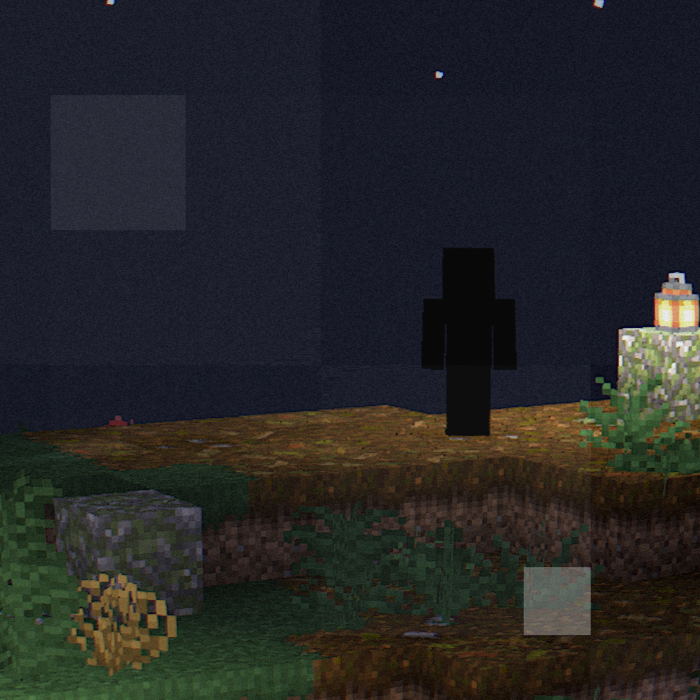

## Entities

This classification is for players who have suffered a fate worse than death and
been warped into, seemingly, monsterous presences.

> - **Name:** [Curved](/wiki/entities/curved)
> - **Notes:**
>
> [Curved](/wiki/entities/curved) is a player-like entity; formerly a player
> named [DyeXD412](/wiki/lore#members). Listening to Disc 13 on loop corrupted
> him and over time turned him into an entity. He appears to be violently
> glitching, his model constantly shaking and visually teleporting around.
>
> 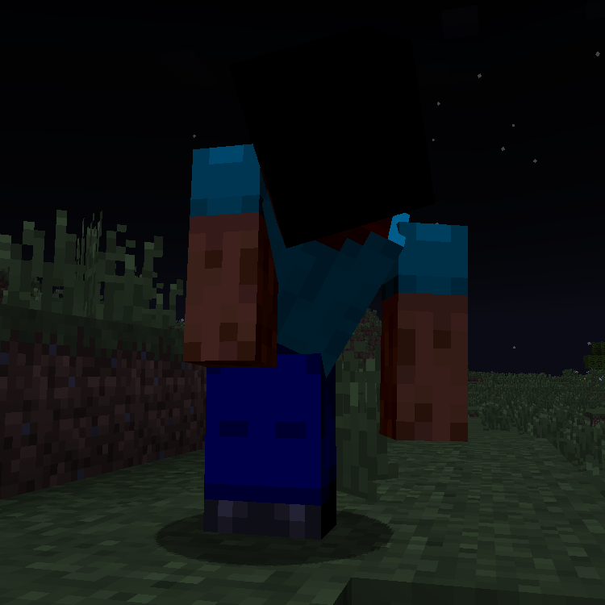

> - **Name:** [Faraway](/wiki/entities/faraway)
> - **Notes:**
>
> [Faraway](/wiki/entities/faraway) is a player-like entity with a solid white
> glowing texture. Faraway will rarely appear on the ground, somewhere in the
> vicinity of the player, and watch them. Occasionally they will slowly move
> towards the player if not directly looked at.
>
> 

> - **Name:** [Hetzer](/wiki/entities/hetzer)
> - **Notes:**
>
> [Hetzer](/wiki/entities/hetzer) could be best described as a "spheroid"
> consisting of several rings encasing a small cube in the center. Its texture
> seems to be white noise. Hetzer is an entity that seems to be shrouded in
> falsehoods, upon approach it will disappear, and an edited version of
> Minecraft's Subwoofer Lullaby, known as the False Subwoofer Lullaby, will play
> before the music abruptly stops, time is set to midnight, and after a minute
> [Circuit](/wiki/entities/circuit) will spawn.
>
> 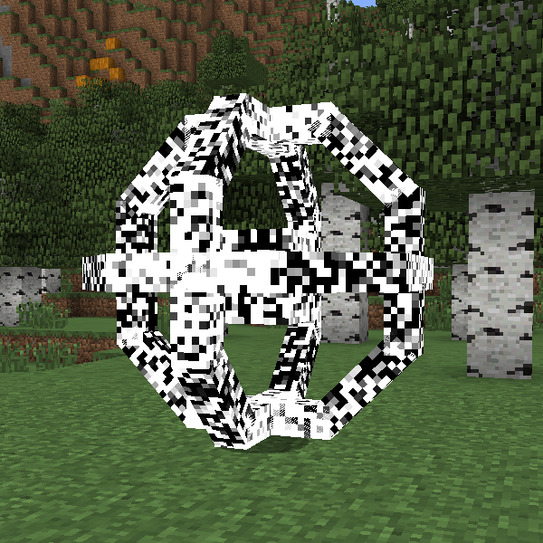

> - **Name:** [Notexture](/wiki/entities/notexture)
> - **Notes:**
>
> [Notexture](/wiki/entities/notexture) is a player-like entity with the ability
> to teleport the player to another dimension when physically interacted with.
> There's little information on him other than what is known of his behavior.
> [Notexture](/wiki/entities/notexture) spawns and replaces blocks with missing
> texture blocks as it moves, and is seemingly hostile.
>
> 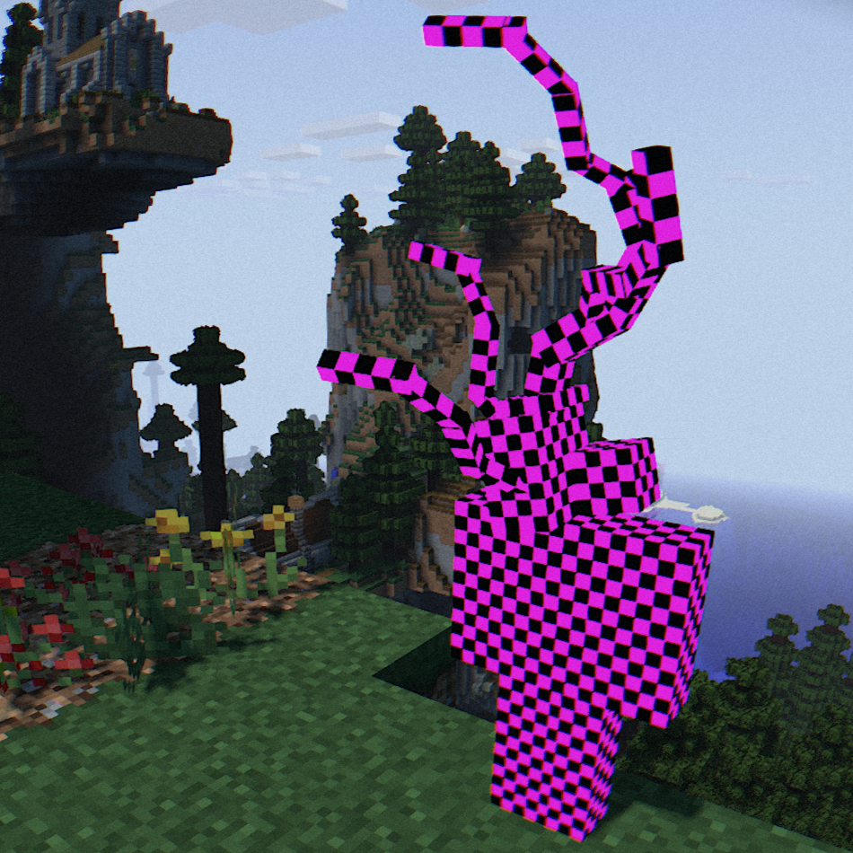

> - **Name:** [Nothing is Watching](/wiki/entities/nothing-is-watching)
> - **Notes:**
>
> [Nothing is Watching](/wiki/entities/nothing-is-watching) is a rectangular
> black censor box with nothing behind it. Upon direct player observation, black
> screen artifacts appear and
> [Nothing is Watching](/wiki/entities/nothing-is-watching) will rapidly begin
> approaching the player, barreling through physical objects, damaging entities,
> and destroying the blocks in its path. Getting hit by it causes the game to
> crash.
>
> 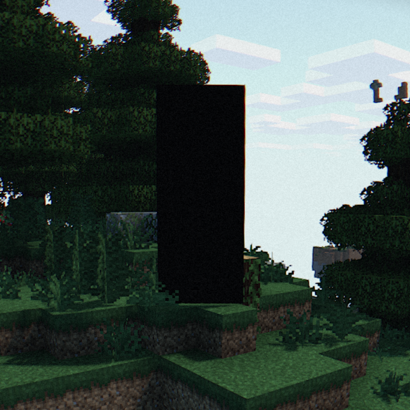

> - **Name:** [r2](/wiki/entities/r2)
> - **Notes:**
>
> [r2](/wiki/entities/r2) (sometimes referred to as "Siluet") is a deformed
> humanoid silhouette with no visible features. It is approximately 3 bloxks
> tall and shakes erratically both when standing still and moving. Upon direct
> player observation, [r2](/wiki/entities/r2) will either disappear or it will
> lock in on the player's location and rapidly begin approach. Physical contact
> with [r2](/wiki/entities/r2) will kill the player and crash their game.
>
> 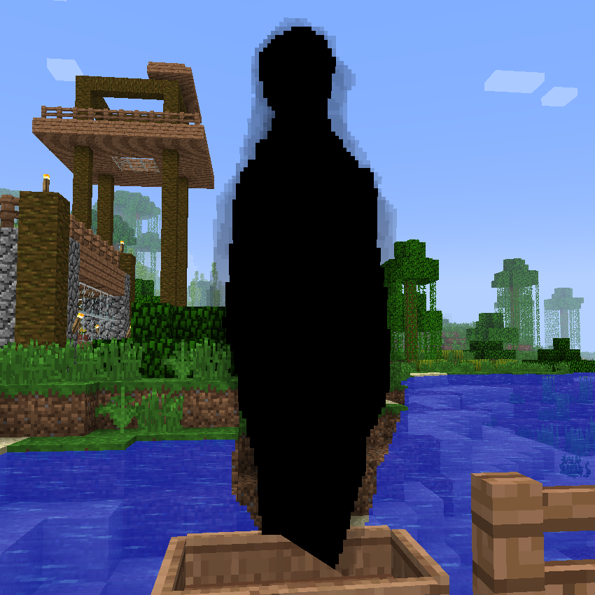

> - **Name:** [Revuxor](/wiki/entities/revuxor)
> - **Notes:**
>
> [Revuxor](/wiki/entities/revuxor) is a player-like entity with a monochrome
> Steve skin. He is one of the more mysterious player-like entities. In any
> instance where the player is going to be banned, he will appear behind them
> for just a single tick.
>
> 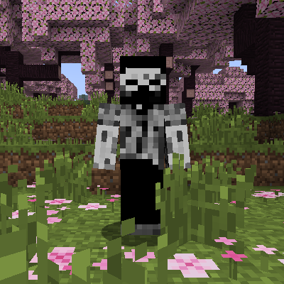

## Anomalies

Classified as players who have also been warped beyond recognition, but not as
powerful as the entities, for the most part, it seems Anomalies are not
outwardly hostile, but relatively benign in their presence.

> - **Name:** [xXram2dieXx](/wiki/entities/xxram2diexx)
> - **Notes:**
>
> [xXram2dieXx](/wiki/entities/xxram2diexx) is a player-like entity and is
> likely a splinter of [0nullvoid0](/wiki/lore/xxram2diexx)'s soul. After
> breaking a hello block, xXram2dieXx will be able to join the world. When this
> happens, the server will inform the player,
> "`Local game hosted on port [00000]`", and then after a few seconds,
> xXram2dieXx can be observed joining the game, and the time will be set to
> midnight.
>
> 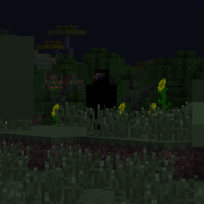

> - **Name:** [Herobrine](/wiki/entities/herobrine)
> - **Notes:**
>
> [Herobrine](/wiki/entities/herobrine) is a player-like entity with a darkened
> Steve skin and glowing white eyes. Herobrine from the creepypasta and legends
> seems to exist within [The Broken Script](/wiki/tbs). How he came to be, what
> his intentions are, and who his affiliations are with, is unknown.
>
> 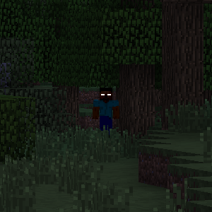

> - **Name:** [Sub Anomaly 1](/wiki/entities/sub-anomaly-1)
> - **Notes:**
>
> [Sub Anomaly 1](/wiki/entities/sub-anomaly-1) appears to be a "cloud" of
> black, spastic particles that has no discernible body or point of origin. Due
> to the appearance, it could be assumed this is a moving mass of corruption,
> which will slowly move towards the player, inflicting damage when near. Not
> much can be said about it, since that is the only thing it does.
>
> 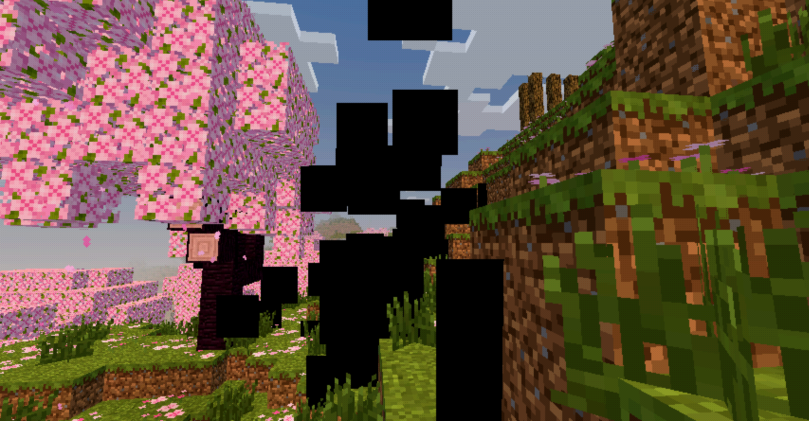

## Void Creatures

[The Broken Script](/wiki/tbs) is antagonized by a trio of **Void Creatures**,
as the name implies, these entities originate from the Void. They are considered
the highest level threat in The Broken Script as encounters with them often end
in the player's demise one way or another.

Through unknown means and under unknown conditions, Void Creatures are seemingly
able to crawl out of the game and into the real world, at least through the
monitors of computers under the influence of the Void.

> - **Name:** [Circuit](/wiki/entities/circuit)
> - **Notes:** Loud.
>
> [Circuit](/wiki/entities/circuit) is the lowest in the Void Creature chain of
> command. He is capable of shapeshifting in order to trick the player.
> [Null](/wiki/entities/null) believes that everything was all his fault, and
> what that implies can only be theorized. It's heavily implied that
> [Circuit](/wiki/entities/circuit) impersonated [Null](/wiki/entities/null) and
> caused the downfall of the clan server. Of the Void Creatures, Circuit's
> behaviors are the most documented, as he frequently haunts every action of the
> players in [The Broken Script](/wiki/tbs). He is also very loud.
>
> 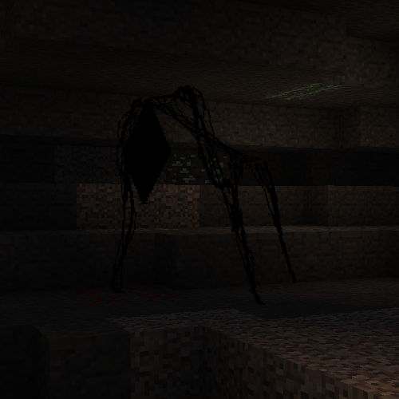

> - **Name:** [Integrity](/wiki/entities/integrity)
> - **Notes:**
>
> [Integrity](/wiki/entities/integrity) is a Void Creature and the main
> antagonist of [The Broken Script](/wiki/tbs), ultimately responsible for
> everything that has occured. He is the presumed source of
> [The Broken Script](/wiki/tbs)'s corruption. It is theorized that at some
> unknown point in time, as early as the Alpha versions of Minecraft,
> [Integrity](/wiki/entities/integrity) entired the world and began waiting for
> players to join it.
>
> 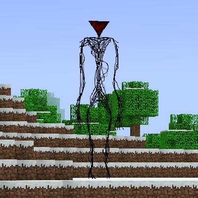

> - **Name:** [The Broken End](/wiki/entities/tbe)
> - **Notes:**
>
> [The Broken End](/wiki/entities/tbe) is a very dangerous Void Creature. His
> size is hulking and it's assumed that he works for
> [Integrity](/wiki/entities/integrity). [The Broken End](/wiki/entities/tbe) is
> a very powerful entity, capable of doing irreversible damage to players by
> killing them and taking their souls. [The Broken End](/wiki/entities/tbe) is
> also capable of causing the
> [minecraft.chatengine](/wiki/mechanics/minecraftchatengine) failure.
>
> 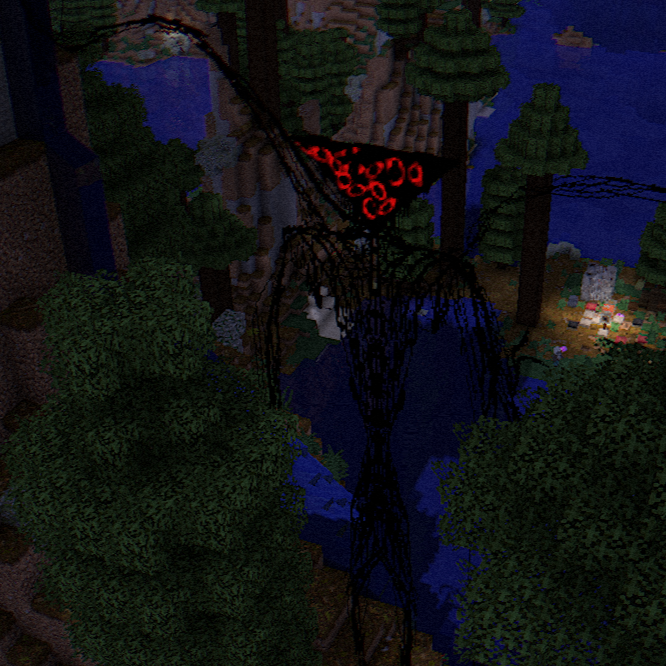
