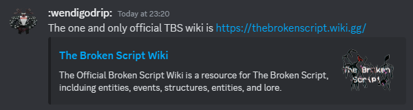

Welcome to the community FAQ.

This page is designed for one thing and one thing only: To help you all navigate
the common questions to cross our community.

# The Broken Script 1.9.3

### Why is the moon purple? Is it broken?

Yeah... It is. It's fixed in the latest alpha for Minecraft 1.21.1 and in the
[community patches](https://discord.com/invite/thebrokencommunity). The
community patches can be found `#mod-archives` channel. Replace the TBS jar with
it.

=(

### Is 1.9.3 the unsafe or safe version of TBS?

1.9.3 is safe, it has no PC manipulations.

### Will 1.9.3 crash my game?

Yes. 1.9.3 will do what TBS has always done, you run the risk of your game crashing due to the
[entities](../entities) within, and/or they will ban you from your own world.
However Wendigodrip has been generous. He has included the command
`/TBS_config` for players to customize and control some of the events and anomalies in TBS.

### Why can't I use commands in my world?

Perhaps [Integrity](../entities/integrity) is preventing you from using commands.

### How to turn off VHS filter? The black bars on the screen? /removevhs no longer works.

Please try to use `/TBS_config`, you will have customization options in there.

### I want to use /TBS_devmode because I can't use /TBS_config

The reason why you can't use `/TBS_config` is because you don't have cheats enabled on the world. Enable LAN, turn cheats on, then disable LAN, this will allow you to use `/TBS_config` The TBS wiki community recommends against `/TBS_devmode` as it is unnecessary however if it's absolutely necessary for you to use it to configure other mods the passcode is ████. You can find it within the files of TBS itself it can also be easily guessed seeing as it's an important date.

### /TBS_devmode doesn't work anymore.

Haha... It does, it just does something very funny. You will need the community patch to be able to use commands.

### Is TBS compatible with multiplayer?

There have been cases of individual players hosting TBS in a multiplayer server, however with severe bugs and frequent crashes and Aeternos will not host it. TBS is not stable in multiplayer and we do not recommend you play it in multiplayer. However, I'm sure there are workarounds if you ask the community nicely. Allegedly, TBS version 1.8 works with Essential and multiplayer.

### Why is TBS not loading?

TBS needs [Geckolib](https://www.curseforge.com/minecraft/mc-mods/geckolib). Make sure you download it.

### Why does my UI look weird?

Either you need to switch from English (US) to English (UK) or open Resource Packs and put mod resources over default package. We use colour, favourite, behaviour, etc. in this household.

=)

### Are there any faces inside the mod?

No, that would be a custom edit of the mod made by Swayle. No, we don't know where to download it. Nor should you want to. It ruins the intended experience of the mod.

# Spectrum_11

### What is spectrum_11 and do I need to download it?

[Spectrum_11](../spectrum-11) is a... To put it in simple terms for the initiates here, spectrum_11 is an Easter egg of sorts, originally found inside of TBS' files but no longer. This is because our host, wendigodrip keeps forgetting to add it into the TBS he uploaded to Modrinth.

### Why is my game/computer lagging so much?

Please make sure you are not playing with spectrum_11 present in your client. It has the ability to open PowerShell (terminal) to constantly mess with your device's sound settings, too many and your computer runs the risk of crashing.

### Why does my text font look so messed up?

That's because of spectrum_11.

### Is spectrum_11 safe?

It is not. It seems that the invasive actions that was present in 1.9 have been all isolated into spectrum_11. It's by suggestion of this wiki community that players do not open a world with spectrum_11 present in their client.

**Do not play with spectrum_11 unless you are prepared for the consequences of your actions.**

# Interactions

### When will things begin?

From what we've observed, it takes a while before events start to ramp up inside of a world. It might take you a few nights in your world before you start seeing more entities. If you want to bother Null, visit his [page](../entities/null) to know more about how to bother him.

### Reputation system? How do you increase/decrease?

Reputation is gained overtime, if the player has a negative reputation so long as the player doesn't antagonize Null into killing them again or destroy Null's structures he will eventually forgive the player. Maintain your good-boy status and he will give more gifts.

### Where is TBE?

Allegedly, he spawns on a specific moon phase.

# Wiki

### Why this wiki?

### Can the information in this wiki be trusted?

Short answer - yes. All information provided in this wiki should be very accurate, as the staff is always patrolling edits and verifying new information with already known facts, the content present in the mod, and statements by wendigodrip, the creator of the mod.
