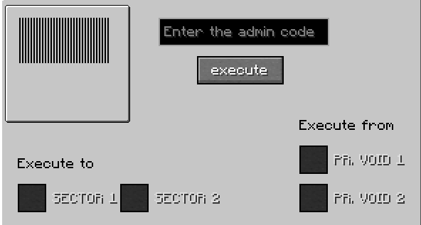
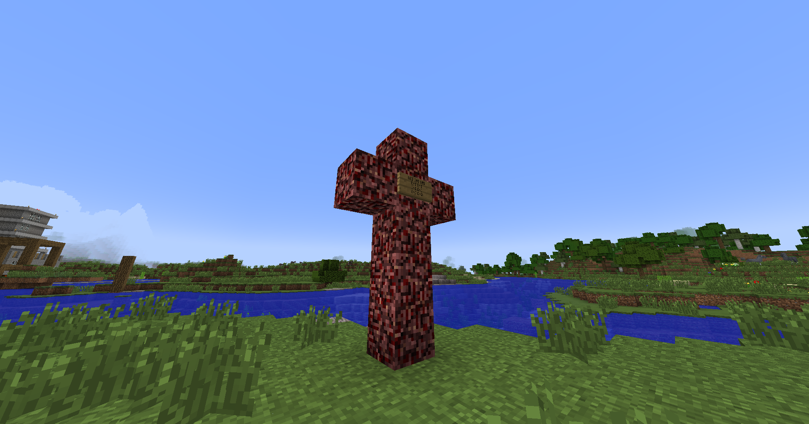
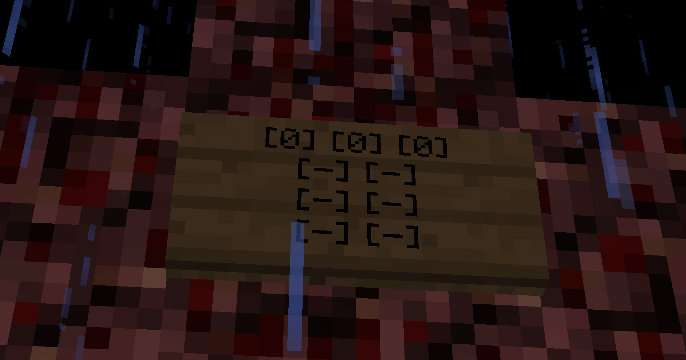

[The Broken Script](/wiki/tbs) adds a few items to the game. A few of them are rather innocuous, but the sourced location of said items can infer meaning to them. This page lists relevant items that require documentation.

# List of Items

## name.null

name.null is an item with a missing texture.

Right-clicking with it in main hand causes it to disappear from the player's inventory.

An item that is just a flat plane of the "missing texture" texture.

## name.revuxor

name.revuxor is an item with a texture depicting an extremely pixelated, grayscale image of [Revuxor](/wiki/entities/revuxor)'s gore after being killed by [Circuit](/wiki/entities/circuit) in real life.

We do not know how or why an image of what was done to Revuxor seems to exist in the game now, and we do not know if it is just an image or if it is actually parts of his decimated body brought into the code.

It can be found in chests in places where Revuxor was present and left something behind, such as the [Gore Structure](/wiki/structures#gore-structure) or [Dead End](/wiki/dimensions/null-torture#dead-end).

## Record 14

Record 14 is a music disc with a texture of Music Disc 13. It can be found in a chest inside the OVERLORD's room in the Cave Base.

The disc depicts a player named [__Blackout__](/wiki/lore#members-1), who was the leader of [Blackout's Clan](/wiki/lore), and how he was ambushed and killed by [Circuit](/wiki/entities/circuit).

## Record 15

*Reader, please refer to the stub notice, thank you.*

Record 15 is a music disc with a texture of Music Disc cat. It is crucial to the beginning of this wiki as it is evidence of a greater conspiracy that was uncovered. Played during an attack from Null, this disc is titled "disc15.betray".

What you hear in the beginning of the disc's audio is a player initially collecting wood and breaking a few leaves as he does so. Around the mid-point of the audio you will begin to hear the rapid placement of blocks. It's assumed that the player here is putting down torches in rapid succession. Afterwards the player will return to logging before walking off a small ledge and injuring themselves seemingly to collect wood that had fallen down. As they continue gathering items on the ground, a drone sound can be heard. Apparently unaware of it, they wander around for a bit more before something lets out a loud, inhuman scream and the disc gets cut short in the middle of it.

The disc depicts a player named [xXram2dieXx](/wiki/entities/xxram2diexx), who was the leader of [xXram2dieXx's Clan](/wiki/lore), and how he was ambushed and killed by [The Broken End](/wiki/entities/tbe).

## Record 16

Record 16 is a music disc with a texture of Music Disc 11. It is dropped by [Curved](/wiki/entities/curved).

The audio is a very crude and robotic voice repeating a string of Hex Code. Transcribed and Translated as follows:

> 49 74 20 77 61 73 20 68 69 6D 2E 20 44 6F 20 6E 6F 74 20 67 6F 20 69
> 6E 74 6F 20 74 68 65 20 63 61 76 65 73 2E 20 50 6C 65 61 73 65 2E 20
> 59 6F 75 20 64 6F 6E 27 74 20 77 61 6E 74 20 74 6F 20 62 65 63 6F 6D
> 65 20 6F 6E 65 20 6F 66 20 74 68 65 6D 2E

> It was him. Do not go into the caves. Please. You don't want to become
> one of them.

# List of Blocks

## 431434

431434 is an indestructible, non-solid block of pitch black color. It is replaceable and can be washed away, dropping itself.

If the player enters it, they will be teleported to either [Clan Void](/wiki/dimensions/clan-void) or [Null Torture](/wiki/dimensions/null-torture). This behavior does not apply to mobs or items.

## Console

Console is an indestructible block which resembles a console. Interacting with it pulls up a GUI with 4 buttons and a text field for entering prompts. As of version 1.9, this block has only one useful use, and that is to teleport the player from Day A / B, Null Torture, The Nether and The End to the overworld.

` sv.exit -> Teleports the player back to the overworld. (When in any Dimension that isnt Overworld)`

Entering certain names in the field and pressing execute overwrites your
prompt with a cryptic message;

` null >>> Outside`
` xXram2dieXx >>> Error`
` Integrity >>> ERR.NEXTNIGHT`

*<small>(NOTE: the buttons do not matter when entering a prompt)</small>*

## Disruption

Disruption is a non-solid block with a missing texture. It can be broken or washed away, dropping name.null.

It disappears approximately 9 seconds after being placed.

## 53135Exit6436

53135Exit6436 is an indestructible, light-emitting, non-solid block of white color. It can be washed away.

If the player enters it, they will be teleported to the Overworld. This behavior does not apply to mobs or items.

## Hello

Hello is a transparent block that can be found in one of xXram2dieXx's chests in the [Clan Build](/wiki/structures/clan-build).

It can be placed by either the player or it can randomly spawn as a [random event](/wiki/mechanics/random-events).

Upon breaking Hello, it will spawn a 5x3 cross made of netherrack with a sign on the 4th height block emitting a fast heartbeat sound for few seconds. Its destruction is a known condition for [xXram2dieXx](/wiki/entities/xxram2diexx) to spawn.

|  |
| --------------- |
| Hello 5x3 cross |

|  |
| --------------- |
| The text that reads on the sign. |

## It

431434 is a transparent, indestructible, non-solid block. It can be washed away, dropping itself.

## oldblock

## Protected Void

Protected Void is an indestructible block.

It has stairs and slab variations.

## Void light

Void light is an indestructible, light-emitting block.

## Void Door

Void Door is a partially transparent, indestructible variant of a door. It can be opened and closed by the player without redstone.