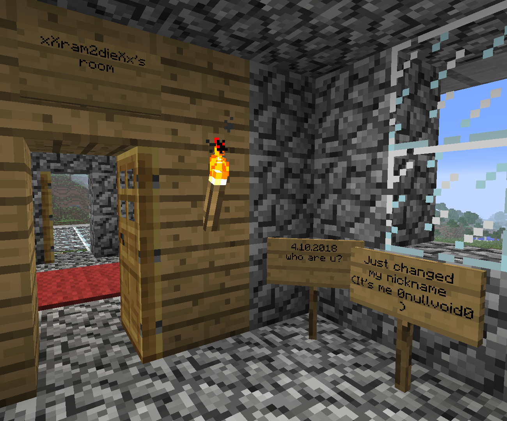
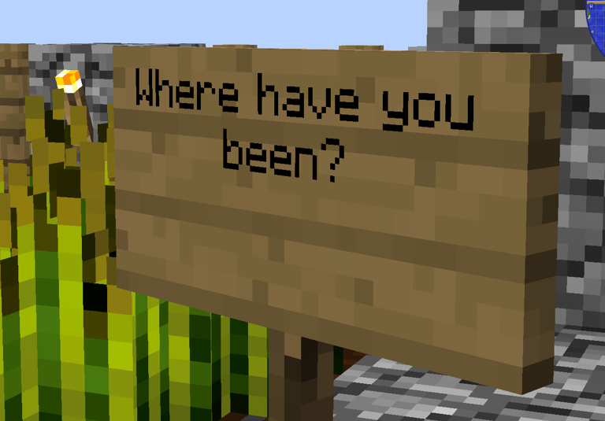
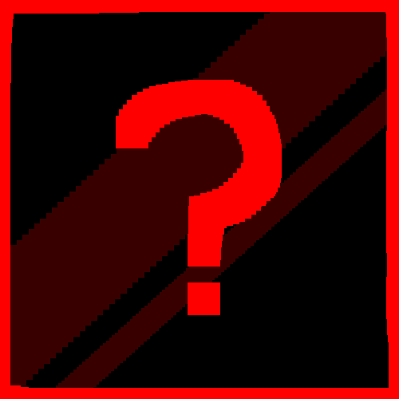

*Lore* because there is no better way to describe what has been found within [The Broken Script](/wiki/tbs) other than *Lore*.

A history of death and destruction lies within the anomalous horror elements of the Broken Script. [Entities](/wiki/entities), [Random Events](/wiki/mechanics/random-events), and even [Structures](/wiki/structures) all hint towards a greater overarching story about what had lead up to this point.

Here lists what has been uncovered, from the players involved with the server before everything occured to the alleged timeline of events.

# Clans

Within the Broken Script, a few usernames can be found across structures, some that have leaked into the worlds currently accessed by players, and some within the recovered chunks of [WORLD2](/wiki/lore/world2). There seemed to be two notable "Clans" that played on the server, see listed below.

## xXram2dieXx's Clan

### Members

> - **Name:** [xXram2dieXx (Formerly 0nullvoid0)](/wiki/lore/xxram2diexx)
> - **Notes:**
>
> xXram2dieXx, also formerly known as `0nullvoid0`, was the leader of his clan.
> His soul likely splintered across several different [Entities](/wiki/entities) within [The Broken Script](/wiki/tbs).
> He seemed to be a spirited and playful person before the events that occured.
>
> 

---

> - **Name:** DyeXD412 [(Curved)](/wiki/entities/curved)
> - **Notes:**
>
> A member of [xXram2dieXx](/wiki/lore/xxram2diexx)'s clan.
> During the events leading up to the downfall of the clan, DyeXD412 was found listening to Disc 13 over and over on the [Clan Build](/wiki/structures/clan-build)'s 4th floor. He would not respond and would keep repeating the disc over and over.
>
> 

---

> - **Name:** [WHYER4](/wiki/lore/whyer4)
> - **Notes:**
>
> Not much is known about WHYER4, aside from the fact that they were a member of [xXram2dieXx](/wiki/lore/xxram2diexx)'s clan.
>
> 

## Blackout's Clan

### Members

> - **Name:** [__Blackout__ (Hetzer)](/wiki/entities/hetzer)
> - **Notes:**
>
> The leader of his clan. He was likely killed by Circuit, as depicted by [Disc 14](/wiki/items#record-14), before becoming [Hetzer](/wiki/entities/hetzer). It is unknown why he is the way he is.
>
> 

---

> - **Name:** OVERLORD
> - **Notes:**
>
> Unknown.
>
> 

---

> - **Name:** catfish12
> - **Notes:**
>
> Unknown.
>
> 

# Timeline

Dated Signs and other such things provide valuable information about the position of events on the timeline.

However, not all events have a known date associated with them, and so some of them, marked with an unknown date - xx.xx.xxxx, are placed on the timeline speculatively; where it makes sense.

## spectrum_11

### xx.xx.xxxx - Void Invasion

At some point in time, through currently unknown means, [Integrity](/wiki/entities/integrity) broke through the bedrock and entered the world, waiting for players to join.

## The Server

### xx.xx.xxxx - Blackout's Clan

At an unknown point in time, __Blackout__, OVERLORD, and catfish12 started playing together and formed a clan.

### xx.xx.xxxx - xXram2dieXx's Clan

At an unknown point in time, 0nullvoid0, DyeXD412, and WHYER4 started playing together and formed a clan. They built their first base as it is seen in [WORLD2](/wiki/lore/world2).

### 02.02.2018 - Weird structure

0nullvoid0 started a diary in which he wrote that after returning from a two-day break, he noticed that a strange, previously unseen structure had appeared in the enchantment room. He did not know who put it there, and he only assumed that it was an admin trolling them.

The structure resembles an altar and, notably, contains Noise Gem Tile blocks that are believed to be from [VoidExp](https://tbotv.miraheze.org/wiki/VoidExp_Wiki).

### 03.02.2018 - Weird sound

0nullvoid0 wrote in his diary that the structure made a weird sound, and that his game started to lag a bit. He also jokingly noted that every mob that gets too close to the structure despawns, attributing it to plugins.

### 04.02.2018 - The clan must grow

0nullvoid0 wrote that it was time to build a base for all of them, because the clan must grow.

It is believed that the base he wrote about eventually became to be [clan_build](/wiki/structures/clan-build).

### xx.xx.xxxx - Blackout's demise

_Blackout_ went mining, and while at it, he was ambushed and killed by [Circuit](/wiki/entities/circuit).

It is these events that are depicted on Record 14.

### 04.08.2018 - Blackout's disappearance

One of the clan members noticed Blackout's disappearance and asked a question, but apparently did not receive an answer.

### 01.10.2018 - Tentant in clan_build

An unknown person rented a spare room in [clan_build](/wiki/structures/clan-build) and presumably moved there.

### 04.10.2018 - Name change

0nullvoid0 changed his nickname to xXram2dieXx.

### 14.10.2018 - Tentant moves out

The unknown person who previously rented the room in [clan_build](/wiki/structures/clan-build) moved out, claiming that they think they needs to build their own base.

### 01.11.2018 - The beginning of the end

[The Broken End](/wiki/entities/tbe) has appeared in the world, causing the chat to break due to a [minecraft.chatengine](/wiki/mechanics/minecraftchatengine) failure.

Clan members noticed the broken chat and wrote about it, starting to use signs as their main means of communication. They also noted that for unknown reasons, the discord server got deleted too.

That same day, they noticed that a group of people stole their old base, and complained that they can't report them due to the deleted discord server.

### 02.11.2018 - Out of wood

The Clan ran out of oak wood, and someone wrote a sign, asking to get more.

### 04.11.2018 - xXram2dieXx's demise

xXram2dieXx agreed to go get oak wood, and while at it, he was ambushed and killed by [The Broken End](/wiki/entities/tbe).

It is these events that are depicted on Record 15.

### xx.xx.xxxx - Noticed absence

The rest of the clan members noticed xXram2dieXx's disappearance, but only assumed that he was tired of playing.

### 04.08.2019 - Weird block

One of Blackout's Clan members found a Noise Gem Tile block in some cave and moved it to their cave base using pistons. No one knew what block it was.

### 06.09.2019 - Deceiver returns

[Circuit](/wiki/entities/circuit), impersonating long-missing xXram2dieXx, returned to the clan under his name, claiming to have had some "troubles" with his family.

### xx.xx.xxxx - DyeXD412's corruption

DyeXD412 started listening to Disc 13 on loop, standing still and ignoring WHYER4 to the point where it looked like he was standing afk with an autoclicker.

It was this disc's influence that led to the gradual corruption of DyeXD412 and his subsequent becoming [Curved](/wiki/entities/curved).

### xx.xx.xxxx - Revuxor's death

At an unknown point in time, [Circuit](/wiki/entities/circuit) entered the real world through [Revuxor](/wiki/entities/revuxor)'s computer, invading his home and soon after ripping him apart.

## The Broken Script

### xx.xx.xxxx - Server World recovered

Somehow, the Server World that the previous players were playing on, which was thought to be lost, was restored.

However, it appears to be heavily corrupted and is therefore generated as a new world, with only [fragmented remnants](/wiki/structures) of the original world being randomly restored.
