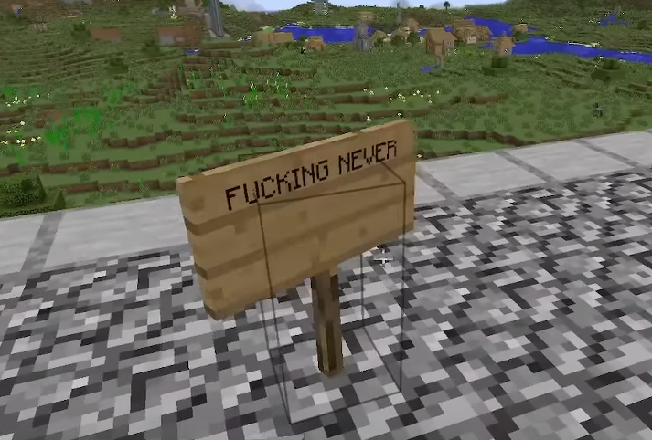

WHYER4 is a member of [0nullvoid0](/wiki/entities/xXram2dieXx)'s Clan.
Through the process of elimination, it can be easily speculated that he
was the last member of the clan to be eradicated or influenced by the
void.

## Appearance

There is currently no depiction of WHYER4's appearance. But considering
the fact that [xXram2dieXx](/wiki/entities/xXram2dieXx)'s and
[DyeXD412](/wiki/entities/curved)'s skin is very likely default Steve, it
wouldn't be far as to consider him having Steve's appearance as well.

## Personality

From what can be read through signs left around the
[clan_build](/wiki/structures/clan-build), WHYER4 starts his sentences with a
capital letter and often ends them without punctuation, he's seen to use
abbreviations and his writing can come off as a little childish.

## Fate

WHYER4's fate is unknown, we do not know how he died nor if he was even
subdued by the void. However, considering the fates of all the other
members of the server thus far that we know of, it's very likely that he
too encountered a grizzly end at the hands of the void.

There is an unsubstantiated theory, that is only built off assumptions
and the elimination process that theorizes WHYER4 to be "He Who Stood on
the Roof of this Hell" responding with great grievance to one of the
void creatures (likely to be [Circuit](/wiki/entities/circuit) disguised as
xXram2dieXx).

> `Just like the others.` \
> `Just close your eyes` \
> `and wait.`

This is all mere speculation. It is fanfiction at best, delusional at
worst. However, we are aware of one thing.

> `"We know that we know nothing, and we can't know anything because there is indeed nothing."`
