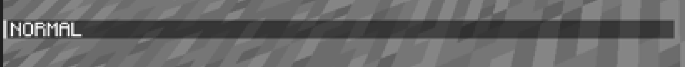

## Null Reputation

**Null Reputation** is a measure of how good your standing with
[Null](/wiki/entities/null) is. Reputation value does not transfer to other
saves and is separate for each world.

The player, when creating a new world, has **NORMAL** reputation. The exception
to this is [WORLD2](/wiki/lore/world2), where the player already has **BAD**
reputation.

### Affecting Reputation

#### Increasing

- Avoiding contact with [Null](/wiki/entities/null).
- Not destroying the [random structures](/wiki/structures).

#### Decreasing

- Triggering [Null](/wiki/entities/null)'s Chase behaviour.
- Destroying his structures.

## Player is already playing on this server

Joining with a specific nickname into a world results in the player getting
kicked with a message accompanying the kick.

| Name             | Kick message                              |
| ---------------- | ----------------------------------------- |
| Null, null       | Player is already playing on this server. |
| xXram2dieXx      | Player is already playing on this server. |
| DyeXD412         | Player is already playing on this server. |
| Integrity        | I am watching you.                        |
| Modrome, modrome | I am right behind you <o>                 |

## No Peaceful Difficulty

The mod removes the ability to switch the game to "Peaceful" difficulty, setting
it to "Easy" when selected.

However, there is a split second where the Difficulty setting can activate,
therefore removing all hostile mobs.

## Old Cave Generation

The mod brings back old cave generation before the Caves and Cliffs update.

Notably, Deepslate has been replaced with regular Stone, and caves are more
enclosed, rather than the vast and expansive caves seen in newer versions.

This brings back the claustrophobic feeling that many players felt pre-update,
and plays well into the aesthetic of the mod.

Mining stone in the Deepslate layer from far enough away will drop deepslate,
allowing the collection of cobbled deepslate despite the replacement. This can
easily be achieved with something like FTB Ultimine.

## Banning

A common occurance when using the mod is being banned from your own Singleplay
server when reaching certain behaviour states with entities.

This can be prevented by changing it in the config.
