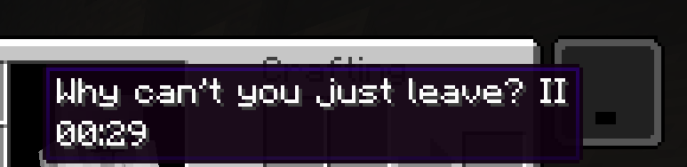

import CaptionedAudio from "../../../../components/CaptionedAudio.astro";

In [The Broken Script](/wiki/tbs), Random events may
occur to the player or the world around the player. These events are
anonymous in nature with no real rhyme or reason to them, some of them
are rather innocuous, maybe some even helpful, meanwhile others maybe
openly malicious.

What is listed here is a collection of of events that has been
documented thus far.

## List of Events

### Music

`song.ogg` starts playing, the player is given blindness
II, slowness II, and slow falling II.

The origin of the song is from [CHRISTMAS EVE PARTY - GEMINI HOME ENTERTAINMENT](https://www.youtube.com/watch?v=gPIN2Q-PBQs&list=TLPQMjMwMzIwMjU-HBskoneyiQ&index=2)

<CaptionedAudio src={import("../../../../assets/wiki/Song.ogg")}>
    `song.ogg`
</CaptionedAudio>

### Null Sad

`normalambienceevent.ogg` starts playing,
subtitled "null sad". This track is also used for the
[Null_Torture](/wiki/dimensions/null-torture) Dimension as well as the
[Clan_Void](/wiki/dimensions/clan-void).

<CaptionedAudio src={import("../../../../assets/wiki/Normalambienceevent.ogg")}>
    `normalambienceevent.ogg`
</CaptionedAudio>

### Null Jumpscare

null appears floating in front of the player accompanied by black
particles and the `randomassjumpscare.ogg` track plays.

<CaptionedAudio src={import("../../../../assets/wiki/Randomassjumpscare.ogg")}>
    `randomassjumpscare.ogg`
</CaptionedAudio>

### Phantom Music Disc 13

The contents of Music Disc 13 start playing globally, seemingly not
coming from anything in particular.

### Phantom Music Disc 11

The contents of Music Disc 11 start playing globally, seemingly not
coming from anything in particular.

### Eerie noises

Random scary sound plays.

### You are not alone

Walking sounds play behind the player.

### OpenGL Error

Messages display in chat:

> `OpenGL Error: 1282 (Invalid operation)` \
> `OpenGL Error: 1282 (Invalid operation)` \
> `OpenGL Error: 1282 (Invalid operation)` \
> `OpenGL Error: 1282 (Invalid operation)` \
> `OpenGL Error: 0 (Here I am.)`

A creepy sound plays.

### Mischief

Frame UI appears with the following text:

> `Good luck.` \
> `\=)`

Time of the day is set to midnight.

### Behind you

Frame UI appears with the following text:

behind you

### null frame

Frame UI appears with 5x9 grid of text each saying "null".

### help frame

Frame UI appears with the following text:

> `help`

### null line

A horizontal line of text repeating “null” over and over appears in the
middle of the screen.

### BSoD

Distorted BSoD appears and `fakebsodauido.ogg` starts playing.

<CaptionedAudio src={import("../../../../assets/wiki/Fakebsodauido.ogg")}>
    `fakebsodauido.ogg`
</CaptionedAudio>

### Lightning

Lightning strikes in a random spot or the player.

### Spontaneous combustion

The player is set on fire.

### Water

Water source block is randomly placed.

### Bedrock

Bedrock block is randomly placed up in the air.

### Music Disc 11

The player is randomly given Music Disc 11.

### Time Skip

Time of the day randomly changes to either day or night.

### Time Freeze

Time of day stops progressing for a random duration

### Teleportation

The player is randomly teleported around.

### Flinging

The player is flung up into the air.

### Null joins

Message displays in chat:

> `Null joined the game`

### Null leaves

Message displays in chat:

> `Null left the game`

### It was your fault.

Message displays in chat:

> `It was your fault.`

### null

Message displays in chat:

> `null`

### null.err

Message displays in chat:

> `null.err`

### 000

Message displays in chat:

> `000`

### I am right behind you.

Message displays in chat:

> `I am right behind you.`

This message can also be displayed in dark red.

### I see you.

Message displays in chat:

> `I see you.`

### Can you see me?

Message displays in chat:

> `Can you see me?`

### Help us.

Message displays in chat:

> `Help us.`

### Joined the game

Yellow message displays in chat:

> `joined the game`

### Obfuscated message

Message displays in chat:

> `AAAAAAAAA` (in obfuscated text)

### Look around

The player's camera is forced to look in the X, Y, Z axes.

### **Leave Potion Effect**

Player is given a potion effect named `Why can't you just leave?` which has gameplay effects and lasts about 60 seconds.

### Lava

A lava block source is placed on player's base to sabotage their home.

### Ghost blocks Area

It will replace all blocks at the players location, in a square of
19x19x19 with invisible blocks you slowly sink through. Stepping inside
causes you to get stuck as if they were cobwebs, their behaviour is
pretty strange, it can cause you to drop from the block randomly, you
will also jitter a little bit when you're inside, stepping outside onto
air, then hitting something stores the fall damage (about 3 hearts)
breaking one of the blocks will make it drop the block it originally
was. the blocks also lag behind once being broken, taking about 5
seconds to actually drop, in that space of time you can mine it over and
over again.

### Random block Deletion

In the same fashion as the ghost block phenomenon, a random area of
blocks near the player can suddenly be replaced by air blocks, seemingly
without any warning, preceding sound or visual cue.

### Hello block Sabotage

Similar to the Lava block source, the [Hello](/wiki/items#hello)
block will be placed at the player's base to sabotage their home.

### 431434 block Sabotage

Similar to the Hello block, the [431434](/wiki/items#431434) block
will be placed in the player's base to sabotage their home.

### Redstone torch

A redstone torch appears near the player. If it's placed in the air, it
will not break unless the player updates it.

### Corruption

A hole to the void surrounded by 4 redstone torches will appear near the
player.

### Chunk corruption.

A chunk will disappear near the player.

### Book

A written book by null will be given to the player

Unfortunately it's not possible to get it in 1.20.1 because the give
command for it does not work.

### Heartbeat

A heartbeat sound will play. The same sound plays when the netherrack
cross with a sign structure is placed when you break the
[Hello](/wiki/items#hello) block.

### Hunger

The player will instantly become hungry.

### Advancements

The player will be granted a random advancement that is either
nullnullnull or Go Away.

### Eyes

Multiple eye particles appear around the player

### Weather change

The weather will change to rain.

### Here I am

Message displays in a java pop up:

> `Here I am.`

### Curious Integrity

A sound labeled as `integrity.curious` will play and the player's render
distance will be set to 2 chunks.

As of the 1.21.1 port and versions 1.9.4 and above, this cannot be changed
in the video settings screen, and you must wait it out for 5 minutes.

### Integrity joining

A sound labeled as `integrity.join` will play.

### Aberration

> _Added: v1.9.5_

A chromatic aberration filter will be applied to the screen for 60 seconds.
